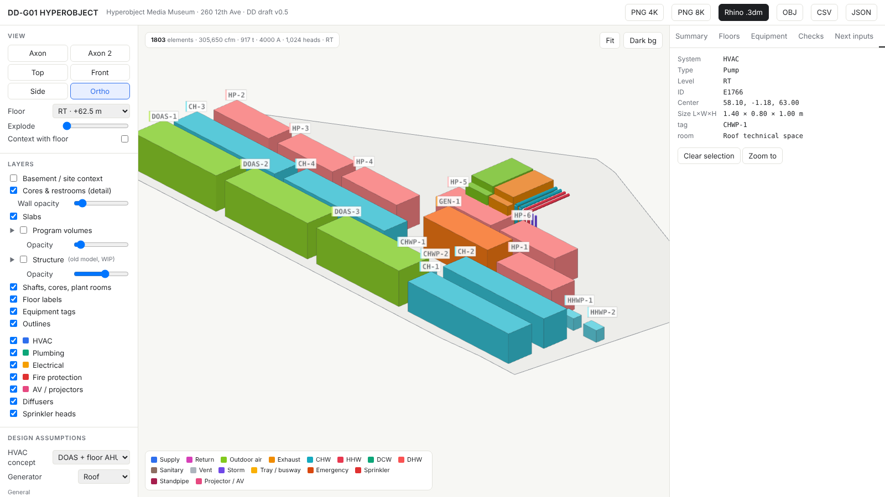

# DD-G01 HYPEROBJECT — MEP Designer

Browser-based Design Development (DD) tool that generates draft **HVAC, plumbing, electrical, fire-protection and AV** systems for the *Hyperobject Media Museum* (260 12th Avenue, Manhattan), directly from the Rhino massing, core and structure models.

It reads FBX exports, applies code-derived sizing rules (NYC Building / Mechanical / Plumbing / Electrical codes, ASHRAE 62.1, NFPA 13/14/20), routes risers and distribution through the modelled shafts and cores, and shows every result in an interactive 3D viewer with schedules, checks and Rhino export.



> **DD coordination tool only.** Results are rules-of-thumb and code-based estimates for spatial coordination. They do not replace engineered calculations or a permit compliance review by licensed NYC MEP/FP engineers.

## Features

- **Model-driven** – levels, slab outlines, program volumes, cores, shafts, stairs, elevators, restrooms, fixtures and basement plant rooms are read from FBX layers.
- **HVAC** – ventilation-rate procedure per zone, cooling/heating loads, supply grids for open-plan spaces, floor AHUs or central roof AHUs, tapering risers, roof plant packed into the technical space.
- **Immersive halls** – ceiling projector rings covering every wall, AV racks, projector heat added to cooling and electrical loads.
- **Plumbing** – fixtures counted from the restroom model and checked against NYC PC Table 403.1, WSFU/DFU sizing, booster pumps and pressure zones, storm leaders, vent through roof.
- **Electrical** – connected/demand load, service size, busway and emergency risers, generator sizing, office workstation loads.
- **Fire** – sprinkler layout by hazard class, one standpipe per stair, fire pump sizing.
- **Coordination checks** – shaft capacity (shafts grow automatically if risers do not fit), ceiling clear height, plant fit, fixtures provided vs required, high-rise triggers.
- **Viewer** – Rhino-style collapsible layer trees (program volumes, structure), ghosted cores and restrooms, floor and basement filters, explode, click-to-inspect rooms and elements, editable assumptions.
- **Exports** – Rhino `.3dm` (nested layers, centerlines, user text), OBJ, CSV floor schedule, JSON model, PNG at 4K / 8K.

## Quick start

Requires **Python 3** (no extra packages) and an internet connection (three.js and rhino3dm load from jsDelivr).

```bash
python tools/serve.py            # opens http://localhost:8765
```

Or serve the `web/` folder with any static server, e.g. `python -m http.server -d web 8765`.

### GitHub Pages

The workflow in `.github/workflows/pages.yml` publishes `web/` on every push to `main`. Enable it once under **Settings → Pages → Source: GitHub Actions**.

> If the workflow file is missing, copy `docs/github-pages-workflow.yml` to `.github/workflows/pages.yml`.

## Updating the model

1. Export from Rhino as FBX (units: metres, Z up) into `models/`, keeping the file and layer names below.
2. Rebuild the browser data:

```bash
python tools/build_data.py
```

| File | Layers read |
|---|---|
| `models/261004_base-program.fbx` | `slab-cut` (or `slabs`), program layers (`immersive spaces/gallery`, `exhibition/gallery`, `food-court - events`, `lobby/cafe/cloakroom`, `musem shop - library`, `OFFICES`, `auditorium`, `terrace`, `roof-technical-space`), `CORES`, `shaft`, `RESTROOM`, `basement`, `technical_room_availability_basement` |
| `models/261004_core_restroom_mod.fbx` | `00_CORES/*` (walls, stairs, elevators, lobbies) and `00_restrooms-column/*`; fixtures are counted by object name (`WC bowl`, `Lavatory`, `Service sink`, `urinal`, `fountain`) |
| `models/*structure*.fbx` | any layer tree; the top-level layers become groups in the Structure tree (newest matching file is used) |

## Repository structure

```
web/                 static viewer (deployable as-is)
  index.html         UI shell
  app.js             three.js viewer, layer trees, inspector, exports
  engine.js          generation, sizing rules, checks (all defaults live here)
  data/              generated by tools/build_data.py — do not edit by hand
tools/
  build_data.py      FBX → web/data/*.js (pure Python)
  fbxparse.py        dependency-free binary FBX reader
  serve.py           local server on :8765
models/              Rhino FBX exports (source geometry)
docs/
  METHODOLOGY.md     sizing rules, code basis, assumptions
```

## Status

DD draft v0.5. See [docs/METHODOLOGY.md](docs/METHODOLOGY.md) for the rules and the open inputs that will make the results more precise.

## Credits

Mattia — SCI-Arc MArchII, AS3222 Design Development, Fall 2026.
